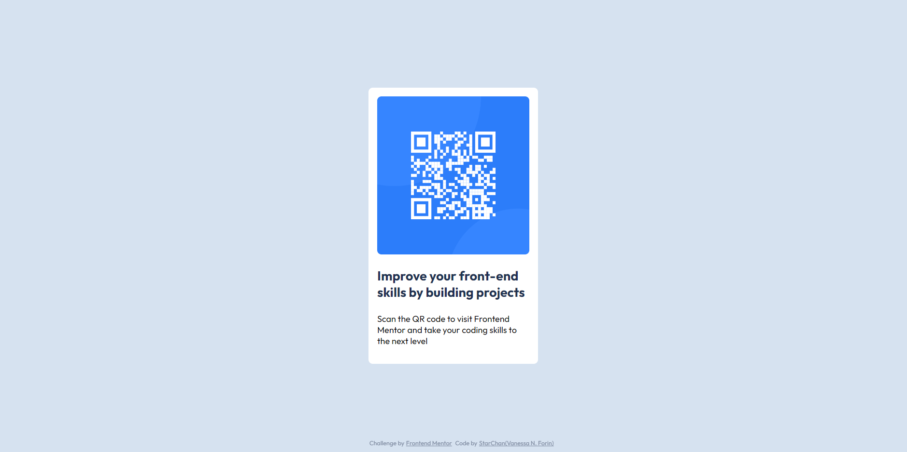

# Frontend Mentor - QR code component solution

This is a solution to the [QR code component challenge on Frontend Mentor](https://www.frontendmentor.io/challenges/qr-code-component-iux_sIO_H). Frontend Mentor challenges help you improve your coding skills by building realistic projects. 

## Table of contents

- [Overview](#overview)
  - [Screenshot](#screenshot)
  - [Links](#links)
- [My process](#my-process)
  - [Built with](#built-with)
- [Author](#author)
- [Acknowledgments](#acknowledgments)

## Overview

### Screenshot

### Links

- Solution URL: [https://starchan013.github.io/qr_code_component_main/]

## My process

### Built with

- HTML5
- CSS
- Virtual Studio Code

## Author

- Website - [StarChan(GitHub)](https://github.com/StarChan013)
- Frontend Mentor - [@StarChan013](https://www.frontendmentor.io/profile/StarChan013)
- Instagram - [@_dev.star](https://www.instagram.com/_dev.star/)

